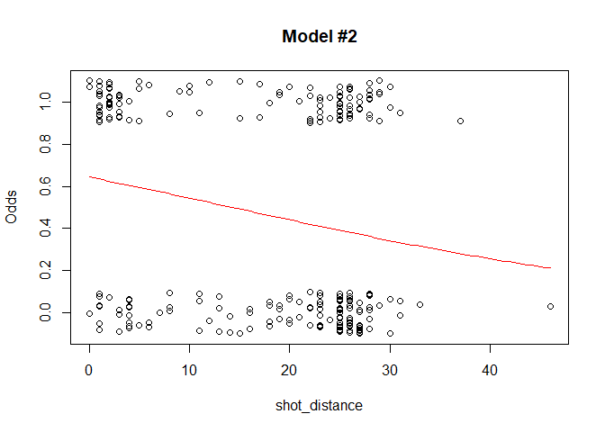
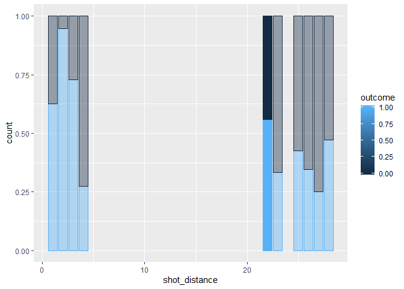

NBA Player Shot Analysis
================
Brian Yi

Introduction
============

**Purpose:** The Golden State Warriors won the 2018 NBA Championship with the help of their leader and 2016 unanimous MVP, Stephen Curry. We are building a model that can analyze the conditions surrounding Steph Curry's shot selection and predict his shot's success rate based on these features. This kind of analysis would be useful to the Golden State Warriors by improving their star player's shooting efficiency. If built properly, this model could help Stephen Curry regain his MVP form and win his organization another championship!

**Method of Approach:** The dataset for this project is extracted from stats.nba.com and can be viewed at the following link: [Data Set Link](https://www.kaggle.com/boonpalipatana/nba-playoff-shots-2018). The NBA 2018 playoff shot data consists of 13,470 observations each with 24 columns that describe the player, shot outcome, shot distance, shot type, minutes remaining etc.

We will build the best logistic regression model that can predict whether Steph Curry makes or misses a shot based on a variety of shot-taking conditions. The features we plan on using to predict Curry's shot `outcome` are: `game_clock`, `shot_distance`, and `home`.

-   `game_clock` is the time in game that Curry takes a shot out of 48 minutes. We want to measure whether Curry becomes more accurate as the game progresses. If he is more accurate in the third and fourth quarters, then maybe he should focus on passing and facilitating the ball earlier on in the ball game.
-   `shot_distance` is the distance from the hoop that Curry takes a shot. Steph Curry is known for his deadly 3-point shooting, so we want to see just how accurate he is far from the hoop. If he is as accurate from behind the 3-point line as he is close to the hoop, shot distance should be insignificant in predicting shot outcome in a logistic regression model.
-   `home` is whether Curry is playing in a home or away game. Usually in sports, having home court advantage with fans cheering for the home team will give them a mental edge throughout the game. We want to see if Steph Curry is affected when he is playing in an away game.

We first create three logistic regression models from varying combinations of these three predictors. Then we evaluate these models using empirical logit plots, Wald tests, and likelihood ratio tests. Finally, we compare models using the nested likelihood ratio test to determine the model that is best at predicting whether Steph Curry will make a shot.

**Results**: Turns out that the best logistic model we built was our final model that uses `shot_distance` and `shot_worth` (variables we added) to predict shot `outcome`. Although Stephen Curry is an amazing 3-point shooter, he still makes layups (shots directly underneath the basket) so accurately that there is still a decreasing trend in efficiency the farther he shoots from the basket. Since `game_clock` and `home` are insignificant predictors, Curry isn't more accurate the longer he is in game and also shoots equally well at an away game as he does at home.

Data Cleaning
=============

We first import the dataset and take a look at the column names and their unique values. The only explanatory variable that requires no manipulation is `shot_distance` that appears in the dataset as `SHOT_DISTANCE`. We have to tidy the data to create the other two explanatory variables: `game_clock` and `home`. We also take note that we do not have a `outcome` binary response variable that would allow it to fit into our logistic regression model. Since we are focusing on Stephen Curry's shot selection, we immediately filter the `playoff_shots` for just his shots.

``` r
# Import playoff_shots dataset
playoff_shots <- read_csv("playoff_shots.csv")

# Look at the dataset
glimpse(playoff_shots)
```

    ## Observations: 13,470
    ## Variables: 24
    ## $ GRID_TYPE           <chr> "Shot Chart Detail", "Shot Chart Detail", ...
    ## $ GAME_ID             <chr> "0041700131", "0041700131", "0041700131", ...
    ## $ GAME_EVENT_ID       <dbl> 149, 153, 155, 187, 195, 242, 246, 263, 26...
    ## $ PLAYER_ID           <dbl> 2544, 2544, 2544, 2544, 2544, 2544, 2544, ...
    ## $ PLAYER_NAME         <chr> "LeBron James", "LeBron James", "LeBron Ja...
    ## $ TEAM_ID             <dbl> 1610612739, 1610612739, 1610612739, 161061...
    ## $ TEAM_NAME           <chr> "Cleveland Cavaliers", "Cleveland Cavalier...
    ## $ PERIOD              <dbl> 1, 1, 1, 2, 2, 2, 2, 2, 2, 2, 3, 3, 3, 3, ...
    ## $ MINUTES_REMAINING   <dbl> 1, 1, 0, 11, 10, 7, 7, 5, 5, 3, 10, 7, 6, ...
    ## $ SECONDS_REMAINING   <dbl> 24, 5, 58, 8, 22, 37, 7, 47, 21, 57, 48, 3...
    ## $ EVENT_TYPE          <chr> "Missed Shot", "Missed Shot", "Missed Shot...
    ## $ ACTION_TYPE         <chr> "Jump Shot", "Driving Layup Shot", "Putbac...
    ## $ SHOT_TYPE           <chr> "3PT Field Goal", "2PT Field Goal", "2PT F...
    ## $ SHOT_ZONE_BASIC     <chr> "Above the Break 3", "Restricted Area", "R...
    ## $ SHOT_ZONE_AREA      <chr> "Left Side Center(LC)", "Center(C)", "Cent...
    ## $ SHOT_ZONE_RANGE     <chr> "24+ ft.", "Less Than 8 ft.", "Less Than 8...
    ## $ SHOT_DISTANCE       <dbl> 26, 0, 0, 1, 1, 22, 0, 2, 2, 2, 6, 29, 23,...
    ## $ LOC_X               <dbl> -168, 3, 0, -8, 2, -109, -8, 14, -7, 9, 27...
    ## $ LOC_Y               <dbl> 206, 1, -6, 13, 10, 201, 5, 15, 20, 27, 63...
    ## $ SHOT_ATTEMPTED_FLAG <dbl> 1, 1, 1, 1, 1, 1, 1, 1, 1, 1, 1, 1, 1, 1, ...
    ## $ SHOT_MADE_FLAG      <dbl> 0, 0, 0, 1, 1, 0, 1, 1, 1, 0, 0, 0, 0, 1, ...
    ## $ GAME_DATE           <dbl> 20180415, 20180415, 20180415, 20180415, 20...
    ## $ HTM                 <chr> "CLE", "CLE", "CLE", "CLE", "CLE", "CLE", ...
    ## $ VTM                 <chr> "IND", "IND", "IND", "IND", "IND", "IND", ...

``` r
# Filter play_off dataset for Curry
Curry <- filter(playoff_shots, PLAYER_NAME == "Stephen Curry")
```

------------------------------------------------------------------------

We first need to create our `outcome` response variable. This variable already exists in our dataset as `EVENT_TYPE` with character values of "Made Shot" and "Missed Shot". We change `EVENT_TYPE` to `outcome` with integer values of 0 and 1.

``` r
# Create shot_outcome variable
Curry <- Curry %>%
  mutate(outcome = case_when(
    EVENT_TYPE == "Missed Shot" ~ 0,
    EVENT_TYPE == "Made Shot" ~ 1))
```

------------------------------------------------------------------------

Next, we create the explanatory variable, `home`, that determines whether a basketball game is a home or away game. Again, this variable already exists in our dataset as `HTM` with character values of which team is at home. We change `HTM` to `home` with values of 0 or 1 such that 1 represents a home game and 0 represents an away game.

``` r
# Create home variable
Curry <- Curry %>%
  mutate(home = case_when(
    HTM == "GSW" ~ 1,
    HTM != "GSW" ~ 0))
```

------------------------------------------------------------------------

The second explanatory variable we create is `game_clock`, which indicates the minute at which Curry takes the shot. We create `game_clock` as a linear combination of `PERIOD`, which indicates the particular 12-minute quarter Steph took the shot, and `MINUTES_REMAINING`, which is how many minutes left in that quarter. We notice that there is only one shot taken beyond the standard 48 minutes at approximately 60 minutes. This probably occured in an overtime quarter so we remove it since it is just one outlier shot.

``` r
# Create game_clock variable
Curry <- Curry %>% 
  mutate(game_clock = 12*(PERIOD - 1) + (12 - MINUTES_REMAINING)) %>% 
  filter(game_clock <= 48)
```

------------------------------------------------------------------------

We do some final renaming and selection so that we have a tidy dataframe with just our response variable `outcome`, and our three explanatory variables: `game_clock`, `shot_distance`, and `home`.

``` r
# Rename SHOT_DISTANCE and select variables of interest
Curry <- Curry %>%
  mutate(shot_distance = SHOT_DISTANCE) %>% 
  select(outcome, game_clock, shot_distance, home)

head(Curry)
```

    ## # A tibble: 6 x 4
    ##   outcome game_clock shot_distance  home
    ##     <dbl>      <dbl>         <dbl> <dbl>
    ## 1       1          8            28     1
    ## 2       0          9             8     1
    ## 3       1          9             3     1
    ## 4       1         11            31     1
    ## 5       1         14             2     1
    ## 6       0         15            26     1

Model \#1: `game_clock`
=======================

For our first model, we will only use `game_clock` to predict `outcome`. We construct a simple logistic regression model and plot it.

``` r
# Create Model #1
(mod1 = glm(outcome ~ game_clock, family = binomial, data = Curry))
```

    ## 
    ## Call:  glm(formula = outcome ~ game_clock, family = binomial, data = Curry)
    ## 
    ## Coefficients:
    ## (Intercept)   game_clock  
    ##   -0.239256     0.004652  
    ## 
    ## Degrees of Freedom: 259 Total (i.e. Null);  258 Residual
    ## Null Deviance:       359.5 
    ## Residual Deviance: 359.2     AIC: 363.2

``` r
# Plot
B0 = summary(mod1)$coef[1]
B1 = summary(mod1)$coef[2]
plot(jitter(outcome, amount = 0.1) ~ game_clock, data = Curry,
     main = "Model #1", ylab = "Odds")
curve(exp(B0 + B1 * x) / (1 + exp(B0 + B1 * x)), add = TRUE, col = "red")
```


Empirical Logit Plot
--------------------

If our logistic regression model is a good fit for the data, Model \#1 will have log(odds) as a linear function of `game_clock`. In other words, regardless of what value of `game_clock`, the odds ratio for a change in `game_clock` is constant. We evaluate Model \#1 for this property through an empirical logit plot.

``` r
# Empirical logit plot
emplogitplot1(mod1, data = Curry, xlim = c(0, 48), ylim = c(-2, 2), ngroups = 30,
              main = "Model #1 Empirical Logit Plot")
```


Unfortunately, the points in this plot are scattered at random and follows no linear pattern whatsoever. Thus, linearity does not hold between `game_clock` nad log(odds) for this model.

Wald Test
---------

Next, we conduct the Wald test to assess the overall effectiveness of Model \#1. We use the `summary` function to view the Wald z-statistic for `game_clock`. The z-statistic tells us if there is correlation between `game_clock` and `outcome`.

``` r
# Wald test
summary(mod1)
```

    ## 
    ## Call:
    ## glm(formula = outcome ~ game_clock, family = binomial, data = Curry)
    ## 
    ## Deviance Residuals: 
    ##    Min      1Q  Median      3Q     Max  
    ## -1.171  -1.128  -1.086   1.221   1.279  
    ## 
    ## Coefficients:
    ##              Estimate Std. Error z value Pr(>|z|)
    ## (Intercept) -0.239256   0.259828  -0.921    0.357
    ## game_clock   0.004652   0.009138   0.509    0.611
    ## 
    ## (Dispersion parameter for binomial family taken to be 1)
    ## 
    ##     Null deviance: 359.45  on 259  degrees of freedom
    ## Residual deviance: 359.19  on 258  degrees of freedom
    ## AIC: 363.19
    ## 
    ## Number of Fisher Scoring iterations: 3

**Null hypothesis**: The coefficient for `game_clock` is zero.

**Alternative hypothesis**: The coefficient for `game_clock` is not zero.

**Result**: The z-statistic equals 0.509, which means that the slope for `game_clock` is only approximately half a standard deviation above zero. A p-value of 0.611 is not less than the criterion of 0.05 so it is insignificant, and we fail to reject the null hypothesis. Thus, the null hypothesis is true, and there is no correlation between `game_clock` and Steph Curry making a shot.

Likelihood Ratio Test
---------------------

Since the Wald test is not as accurate on smaller sample sizes, we also conduct a likelihood ratio test (G-test) to assess the overall effectiveness of Model \#1. In this case, the G-test compares Model \#1 to a slope-intercept model.

``` r
# Likelihood ratio test
G = summary(mod1)$null.deviance - summary(mod1)$deviance
sprintf("G-statistic: %e  p-value: %e", G, 1 - pchisq(G, 1))
```

    ## [1] "G-statistic: 2.594646e-01  p-value: 6.104882e-01"

**Null hypothesis**: The coefficient of `game_clock` is zero.

**Alternative hypothesis**: The coefficient of `game_clock` is not zero.

**Result**: We view the G-statistic as improvement gained from adding the `game_clock` term to our model. Since a G-statistic of 0.259 is very small, adding the `game_clock` term to our model didn't really improve it. We find the p-value to be 0.610, which is insignificant, so we fail to reject the null hypothesis. Therefore, the null hypothesis is true and there is no correlation between `game_clock` and Steph Curry making a shot.

Confidence Interval
-------------------

We calculate a 95% confidence interval for coefficient estimates of `game_clock`.

``` r
# Confidence interval
exp(confint.default(mod1))
```

    ##                 2.5 %   97.5 %
    ## (Intercept) 0.4730715 1.309961
    ## game_clock  0.9868292 1.022819

We are 95% confidence the true mean lies on the interval (0.987, 1.023). This means that we are 95% confident that as `game_clock` increases by one minute, the increase in odds of Steph Curry making a shot will fall between (0.987, 1.023). In other words, an increase of one minute in `game_clock` either decreases Steph Curry's chances of making a shot by as much as a factor of 0.987 or increases his chances of making a shot by as much as a factor of 1.023. Since the chances that Steph Curry will make a shot can increase or decrease as `game_clock` increases, `game_clock` is not a very good predictor for `outcome`. This supports our summary analysis above where we didn't find much of a correlation between `game_clock` and Steph Curry making a shot.

Model \#2: `shot_distance`
==========================

For our second model, we will again only use one explanatory variable, `shot_distance`, to predict `outcome`. The process of creating and assessing the model's ability to predict `outcome` should be very similar to what we did for Model \#1; we start by constructing a simple logistic regression model and plotting it.

``` r
# Model #2
(mod2 = glm(outcome ~ shot_distance, family = binomial, data = Curry))
```

    ## 
    ## Call:  glm(formula = outcome ~ shot_distance, family = binomial, data = Curry)
    ## 
    ## Coefficients:
    ##   (Intercept)  shot_distance  
    ##       0.58956       -0.04136  
    ## 
    ## Degrees of Freedom: 259 Total (i.e. Null);  258 Residual
    ## Null Deviance:       359.5 
    ## Residual Deviance: 347.2     AIC: 351.2

``` r
# Plot
B0 = summary(mod2)$coef[1]
B1 = summary(mod2)$coef[2]
plot(jitter(outcome,amount = 0.1) ~ shot_distance, data = Curry,
     main = "Model #2", ylab = "Odds")
curve(exp(B0 + B1 * x)/(1 + exp(B0 + B1 * x)), add = TRUE, col = "red")
```



Empirical Logit Plot
--------------------

We again construct a empirical logit plot to get an initial assessment of Model \#2.

``` r
# Empirical logit plot
emplogitplot1(mod2, data = Curry, xlim = c(0, 33), ylim = c(-2, 2), ngroups = 9,
              main = "Model #2 Empirical Logit Plot")
```


Model \#2 is a good fit for the data if log(odds) is a linear function of `shot_distance`. Since most of the points in this plot follow a linear trend and do not stray too far from the line, Model \#2 may be a good fit for our data.

Wald Test
---------

We again conduct a Wald test to evaluate the overall fit of Model \#2.

``` r
# Wald test
summary(mod2)
```

    ## 
    ## Call:
    ## glm(formula = outcome ~ shot_distance, family = binomial, data = Curry)
    ## 
    ## Deviance Residuals: 
    ##     Min       1Q   Median       3Q      Max  
    ## -1.4358  -1.0282  -0.9474   1.1905   1.5939  
    ## 
    ## Coefficients:
    ##               Estimate Std. Error z value Pr(>|z|)    
    ## (Intercept)    0.58956    0.24311   2.425 0.015306 *  
    ## shot_distance -0.04136    0.01202  -3.442 0.000578 ***
    ## ---
    ## Signif. codes:  0 '***' 0.001 '**' 0.01 '*' 0.05 '.' 0.1 ' ' 1
    ## 
    ## (Dispersion parameter for binomial family taken to be 1)
    ## 
    ##     Null deviance: 359.45  on 259  degrees of freedom
    ## Residual deviance: 347.17  on 258  degrees of freedom
    ## AIC: 351.17
    ## 
    ## Number of Fisher Scoring iterations: 4

**Null hypothesis**: The coefficient for `shot_distance` is zero.

**Alternative hypothesis**: The coefficient for `shot_distance` is not zero.

**Result**: The z-statistic equals -3.442, which means the slope of `shot_distance` is more than three standard deviations below zero. A p-value of 5.78e-4 is significant so we can reject the null hypothesis. Thus, the alternative hypothesis is true and there is signficant correlation between `shot_distance` and Steph Curry making the shot.

Likelihood Ratio Test
---------------------

We conduct a likelihood ratio test (G-test) for a secondary validation of Model \#2.

``` r
# Likelihood ratio test
G2 = summary(mod2)$null.deviance - summary(mod2)$deviance
sprintf("G-statistic: %e  p-value: %e", G2, 1 - pchisq(G2, 1))
```

    ## [1] "G-statistic: 1.228488e+01  p-value: 4.566432e-04"

**Null hypothesis**: The coefficient of `shot_distance` is zero.

**Alternative hypothesis**: The coefficient of `shot_distance` is not zero.

**Result**: We view the G-statistic as improvement gained from adding the `shot_distance` term to our model. Since a G-statistic of approximately 12.28 is much greater than zero, this indicates that adding the `shot_distance` term to our model did improve our model. A p-value of 4.57e-4 is significant so we reject the null hypothesis. Thus, the alternative hypothesis is true and there is significant correlation between Steph Curry making a shot and `shot_distance`.

Confidence Interval
-------------------

We again calculate a 95% confidence interval to determine how much Curry's chances of making a shot decreases as `shot_distance` increases.

``` r
# Confidence interval
exp(confint.default(mod2))
```

    ##                   2.5 %    97.5 %
    ## (Intercept)   1.1197079 2.9039019
    ## shot_distance 0.9371499 0.9823526

We are 95% confidence the true mean lies on the interval (0.937, 0.982). This means that as `shot_distance` increases by one foot, the decrease in odds of Steph Curry making the shot will fall between (0.937, 0.982). In other words, we are 95% confident that Steph Curry's chances of making a shot will decrease by as little as a factor of 0.982 or decrease as much as a factor of 0.937 for every foot farther from the basket he shoots the ball from. This makes sense since making a three point bucket 24 feet out is way harder than making a layup right in front of the basket.

Stephen Curry 3-Point Accuracy?
-------------------------------

However, I want to understand why `shot_distance` is a significant explanatory variable in predicting Stephen Curry's shot. Already known as the best distance shooter of all time due to how well he shoots the 3-point shot, I thought that `shot-distance` would not be a significant variable in predicting Curry's shot outcome within a logistic model. I decide to visualize the proportion of shots he makes depending on `shot_distance`. I also filter out distances where he took 5 shots or less.

``` r
# Filtering out the distances that he takes 5 shots or less
greater_than_5 <- Curry %>% 
  group_by(shot_distance) %>%
  count() %>% 
  filter(n > 5)

# Visualization through bar chart
Curry %>% 
  right_join(greater_than_5, "shot_distance") %>% 
  ggplot() +
  geom_bar(aes(shot_distance, group = outcome, fill = outcome, color = outcome), position = "fill", alpha = 2/5) +
  geom_bar(data = filter(Curry, shot_distance == 22),
            aes(shot_distance, group = outcome, fill = outcome), position = "fill")
```



*Each bar is split into a light blue and black section. The light blue represents the proportion of shots that Curry makes at that particular `shot_distance`. We single out one bar (22 feet) that will be addressed later on.*

This visualization makes it much more clear how there is a clear downward trend in percentage of shots made as `shot_distance` increases. Even though Steph Curry is remarkably accurate from distance, it isn't enough to discourage a correlation between `shot_distance` and `outcome` in a simple logistic regression model.

On an interesting note, we highlight the `shot_distance` bar at 22 feet that corresponds to 3-point shots taken at the left and right corners of the court. Steph Curry makes over 50% of those 3-point shots! At the corners of the court, he is almost as accurate as he is 1 foot away from the basket!

Model \#3: `shot_distance + game_clock + home`
==============================================

After creating two separate simple logistic regression models for `game_clock` and `shot_distance`, we will now create a multiple logistic regression model using `game_clock`, `shot_distance`, and `home`.

``` r
# Model #3
(mod3 = glm(outcome ~ shot_distance + game_clock + home, family = binomial, data = Curry))
```

    ## 
    ## Call:  glm(formula = outcome ~ shot_distance + game_clock + home, family = binomial, 
    ##     data = Curry)
    ## 
    ## Coefficients:
    ##   (Intercept)  shot_distance     game_clock           home  
    ##      0.351177      -0.042356       0.002407       0.335520  
    ## 
    ## Degrees of Freedom: 259 Total (i.e. Null);  256 Residual
    ## Null Deviance:       359.5 
    ## Residual Deviance: 345.4     AIC: 353.4

Likelihood Ratio Test
---------------------

We first conduct a likelihood ratio test (G-test) to test for the overall effectiveness of the model. This time, we are comparing our model with three predictors to a slope-intercept model.

``` r
# Likelihood ratio test
G3 = summary(mod3)$null.deviance - summary(mod3)$deviance
sprintf("G-statistic: %e  p-value: %e", G3, 1 - pchisq(G3, 1))
```

    ## [1] "G-statistic: 1.401540e+01  p-value: 1.813193e-04"

**Null hypothesis**: The coefficients of the predictors are all zero.

**Alternative hypothesis**: At least one of the coefficients of the predictors is not zero.

**Result**: We view the G-statistic as improvement gained from adding `game_clock`, `shot_distance`, and `home` predictors to a slope-intercept model. Since a G-statistic equals 14.0154, adding the three predictors definitely improved our model. A p-value of 1.813e-4 is significant so we can reject the null hypothesis. Therefore, the alternative hypothesis is true and there is some correlation between Steph Curry making a shot and at least one of the predictors: `game_clock`, `shot_distance`, and `home`.

Wald Test
---------

Our likelihood ratio test determined that at least one of our predictors has a significant correlation with `outcome`. Now we will run the Wald test again to see which of our predictors has that significant correlation.

``` r
# Wald test
summary(mod3)
```

    ## 
    ## Call:
    ## glm(formula = outcome ~ shot_distance + game_clock + home, family = binomial, 
    ##     data = Curry)
    ## 
    ## Deviance Residuals: 
    ##     Min       1Q   Median       3Q      Max  
    ## -1.5184  -1.0471  -0.8809   1.1869   1.5407  
    ## 
    ## Coefficients:
    ##                Estimate Std. Error z value Pr(>|z|)    
    ## (Intercept)    0.351177   0.374361   0.938 0.348209    
    ## shot_distance -0.042356   0.012147  -3.487 0.000489 ***
    ## game_clock     0.002407   0.009405   0.256 0.797991    
    ## home           0.335520   0.260482   1.288 0.197720    
    ## ---
    ## Signif. codes:  0 '***' 0.001 '**' 0.01 '*' 0.05 '.' 0.1 ' ' 1
    ## 
    ## (Dispersion parameter for binomial family taken to be 1)
    ## 
    ##     Null deviance: 359.45  on 259  degrees of freedom
    ## Residual deviance: 345.44  on 256  degrees of freedom
    ## AIC: 353.44
    ## 
    ## Number of Fisher Scoring iterations: 4

**Null hypothesis**: The coefficient for the tested predictor is zero. **Alternative hypothesis**: The coefficient for the tested predictor is not zero.

**Result:**

-   `shot_distance`: The z-statistic is -3.487, which means the slope for `shot_distance` is more than three standard deviations below zero. A p-value of 4.89e-4 is significant so we can reject the null hypothesis. Thus, the alternative hypothesis is true, and there is significant correlation between `shot_distance` and Steph Curry making a shot.

-   `game_clock`: The z-statistic is 0.256, which means the slope for `game_clock` is very close to zero. A p-value of 0.798 is insignificant so we fail to reject the null hypothesis. Thus, the null hypothesis is true, and there is no significant correlation between `game_clock` and Steph Curry making a shot.

-   `home`: The z-statistic is 1.288, which means the slope for home is one standard deviation above zero. The p-value of 0.198 is insignificant so we fail to reject the null hypothesis. Thus, the null hypothesis is true, and there is no significant correlation between Steph Curry making a shot and whether or not he is playing at home.

In conclusion, since one of our predictors is significant, our results match that of the G-test.

Finding the Best Model
======================

We first compare our two simple logistic regression models, `game_clock` and `shot_distance`. We already know that `shot_distance` is the better model because its predictor is significant while `game_clock` isn't; we still compare the two G-statistics and plot both empirical logit plots side by side as another metric for comparison.

``` r
# Likelihood ratio test
sprintf("Model #1 G-statistic: %e  Model #2 G-statistic: %e", G, G2)
```

    ## [1] "Model #1 G-statistic: 2.594646e-01  Model #2 G-statistic: 1.228488e+01"

``` r
# Empirical logit plots
emplogitplot1(mod1, data = Curry, xlim=c(0,48), ylim=c(-2,2), ngroups = 30, main = "Model #1")
```


``` r
emplogitplot1(mod2, data = Curry, xlim=c(0,33), ylim=c(-2,2), ngroups = 9, main = "Model #2")
```


The G-statistic measures the difference in residual deviances for both models. The higher the difference in residual deviance, the greater the improvement in the model when including the respective predictor. The `shot_distance` model clearly wins here with a G-statistic of approximately 12 while the `game_clock` model has a G-statistic of close to 0.

If we look at the empirical logit plots, the `shot_distance` model holds linearity way better compared to the `game_clock` model.

In conclusion, the `shot_distance` model is a much more effective simple logistic regression model at predicting whether Steph Curry will make a shot in the 2018 NBA playoffs.

Nested Likelihood Ratio Test
----------------------------

We now test Model \#3 with the `shot_distance` model through a nested likelihood ratio test.

``` r
# Nested likelihood ratio test
G4 = summary(mod2)$deviance - summary(mod3)$deviance
sprintf("G-statistic: %e  p-value: %e", G4, 1 - pchisq(G4, 1))
```

    ## [1] "G-statistic: 1.730524e+00  p-value: 1.883440e-01"

We view the G-statistic as improvement gained from adding `game_clock` and `home` predictors to our `shot_distance` model. The G-statistic is 1.731 (pretty close to zero), which means that adding the two predictors only slightly improved our model since there is a small difference in deviances. A p-value of 0.188 is insignficiant so we fail to reject the null hypothesis. Therefore, the null hypothesis is true indicating that the addition of the `game_clock` and `home` terms to our `shot_distance` model is not a significant improvement in predicting the odds of Steph Curry making a shot.

**In conclusion, our `shot_distance` simple logistic model (Model \#2) is the best model out of the three.**

Final Model
-----------

After seeing the results of our previous analysis, I want to add some new variables to build a new model. I want to know whether Curry becomes more accurate as each quarter comes to a close and whether he is more accurate shooting a 3-point shot as compared to a 2-point shot. As a result, we add `seconds_remaining` and `shot_worth` variables to our dataset to model.

``` r
# Cleaning dataset for just our five explanatory variables and one response variable
tmp <- playoff_shots %>% 
  
  # Filtering dataset for Stephen Curry
  filter(PLAYER_NAME == "Stephen Curry") %>%
  
  # Creating shot_worth variable
  mutate(shot_worth = case_when(
    SHOT_TYPE == "2PT Field Goal" ~ 0,
    SHOT_TYPE == "3PT Field Goal" ~ 1)) %>% 
  
  # Creating seconds_remaining variable
  mutate(seconds_remaining = SECONDS_REMAINING) %>% 
  
  # Adding game_clock, shot_distance, home
  mutate(outcome = case_when(
    EVENT_TYPE == "Missed Shot" ~ 0,
    EVENT_TYPE == "Made Shot" ~ 1),
        home = case_when(
    HTM == "GSW" ~ 1,
    HTM != "GSW" ~ 0),
        game_clock = 12*(PERIOD - 1) + (12 - MINUTES_REMAINING),
        shot_distance = SHOT_DISTANCE) %>% 
  
  # Choosing only shots in the first 48min. of regulation time
  filter(game_clock <= 48) %>% 
  
  # Selecting only our variables of interest
  select(seconds_remaining, shot_distance, game_clock, home, shot_worth, outcome)

# bestglm function
tmp = as.data.frame(tmp)
mod4 <- bestglm(Xy = tmp, family = binomial, IC = "AIC", method = "exhaustive")
```

    ## Morgan-Tatar search since family is non-gaussian.

``` r
# Printing results
mod4$BestModels
```

    ##   seconds_remaining shot_distance game_clock  home shot_worth Criterion
    ## 1             FALSE          TRUE      FALSE FALSE       TRUE  347.1022
    ## 2             FALSE          TRUE      FALSE  TRUE       TRUE  347.3941
    ## 3              TRUE          TRUE      FALSE FALSE       TRUE  348.5493
    ## 4              TRUE          TRUE      FALSE  TRUE       TRUE  348.9164
    ## 5             FALSE          TRUE       TRUE FALSE       TRUE  349.0858

``` r
mod4$BestModel
```

    ## 
    ## Call:  glm(formula = y ~ ., family = family, data = Xi, weights = weights)
    ## 
    ## Coefficients:
    ##   (Intercept)  shot_distance     shot_worth  
    ##       0.78337       -0.08501        1.06021  
    ## 
    ## Degrees of Freedom: 259 Total (i.e. Null);  257 Residual
    ## Null Deviance:       359.5 
    ## Residual Deviance: 343.1     AIC: 349.1

We plug `shot_distance`, `game_clock`, `home`, `seconds_remaining`, and `shot_worth` into our `bestglm` function to find the best logistic model. This model is chosen based on the AIC/R-squared values of the individual models. In general if the AIC is lower, the model will be better. This time, the best model has two variables, `shot_distance` and `shot_worth`, to predict `outcome`. With an AIC value of 349.1 and a G-statistic of 16.4, we can say that this model is better than Model \#2 that only uses `shot_distance` as a predictor.

Conclusion
==========

Our initial goal was to build a model that can accurately predict whether Stephen Curry's shot goes in based on his shot selection conditions. This project mostly focused on using the empirical logit plot, Wald test, and likelihood ratio test to evaluate the three logistic regression models we built. We then used the nested likelihood ratio test to determine that Model \#2 (`shot_distance` to predict `outcome`) to be the best model out of the three. We finally used `bestglm` to discover a model that has a lower AIC and higher G-statistic value that uses `shot_distance` and `shot_worth` to predict shot `outcome`. We settle with this model as our final product to predict the likelihood of Stephen Curry making a shot in the NBA.
