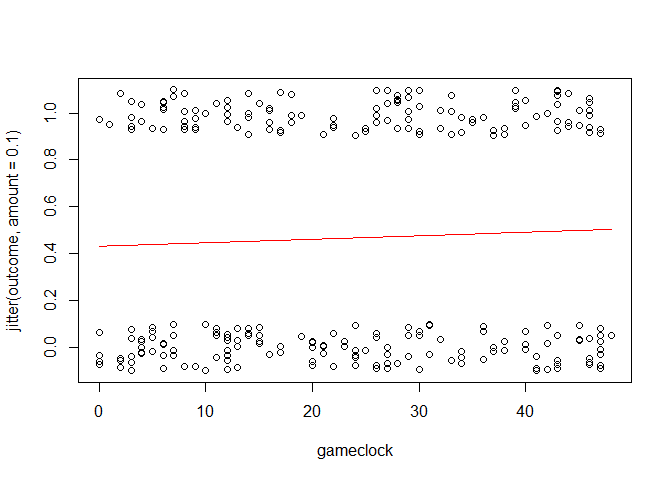
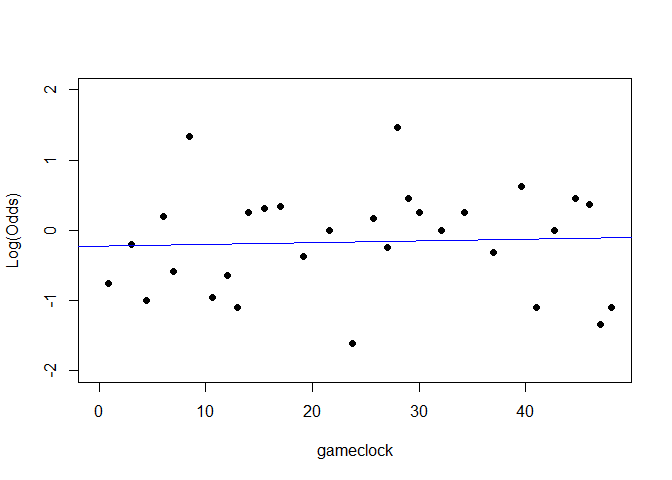
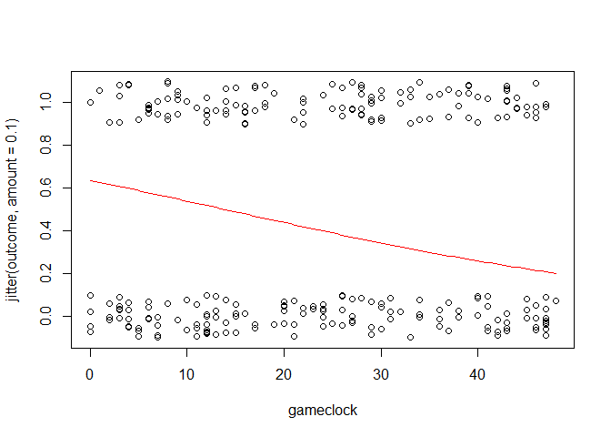
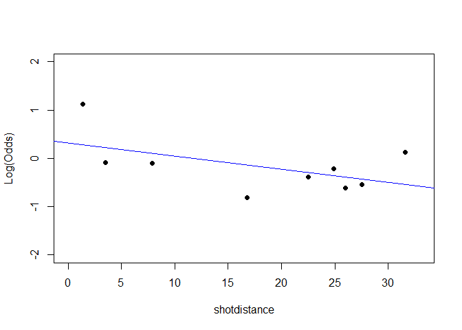

NBA Player Shot Analysis
================
Brian Yi

[Data Set Link](https://www.kaggle.com/boonpalipatana/nba-playoff-shots-2018)

``` r
library(readr)
library(mosaic)
```

    ## Loading required package: dplyr

    ## 
    ## Attaching package: 'dplyr'

    ## The following objects are masked from 'package:stats':
    ## 
    ##     filter, lag

    ## The following objects are masked from 'package:base':
    ## 
    ##     intersect, setdiff, setequal, union

    ## Loading required package: lattice

    ## Loading required package: ggformula

    ## Loading required package: ggplot2

    ## Loading required package: ggstance

    ## 
    ## Attaching package: 'ggstance'

    ## The following objects are masked from 'package:ggplot2':
    ## 
    ##     geom_errorbarh, GeomErrorbarh

    ## 
    ## New to ggformula?  Try the tutorials: 
    ##  learnr::run_tutorial("introduction", package = "ggformula")
    ##  learnr::run_tutorial("refining", package = "ggformula")

    ## Loading required package: mosaicData

    ## Loading required package: Matrix

    ## Registered S3 method overwritten by 'mosaic':
    ##   method                           from   
    ##   fortify.SpatialPolygonsDataFrame ggplot2

    ## 
    ## The 'mosaic' package masks several functions from core packages in order to add 
    ## additional features.  The original behavior of these functions should not be affected by this.
    ## 
    ## Note: If you use the Matrix package, be sure to load it BEFORE loading mosaic.

    ## 
    ## Attaching package: 'mosaic'

    ## The following object is masked from 'package:Matrix':
    ## 
    ##     mean

    ## The following object is masked from 'package:ggplot2':
    ## 
    ##     stat

    ## The following objects are masked from 'package:dplyr':
    ## 
    ##     count, do, tally

    ## The following objects are masked from 'package:stats':
    ## 
    ##     binom.test, cor, cor.test, cov, fivenum, IQR, median,
    ##     prop.test, quantile, sd, t.test, var

    ## The following objects are masked from 'package:base':
    ## 
    ##     max, mean, min, prod, range, sample, sum

``` r
library(dplyr)
library(car)
```

    ## Loading required package: carData

    ## 
    ## Attaching package: 'car'

    ## The following objects are masked from 'package:mosaic':
    ## 
    ##     deltaMethod, logit

    ## The following object is masked from 'package:dplyr':
    ## 
    ##     recode

``` r
library(Stat2Data)
library(bestglm)
```

    ## Loading required package: leaps

``` r
Curry <- read_csv("StephCurry.csv")
```

    ## Parsed with column specification:
    ## cols(
    ##   .default = col_double(),
    ##   GRID_TYPE = col_character(),
    ##   PLAYER_NAME = col_character(),
    ##   TEAM_NAME = col_character(),
    ##   EVENT_TYPE = col_character(),
    ##   shottype = col_character(),
    ##   SHOT_TYPE = col_character(),
    ##   SHOT_ZONE_BASIC = col_character(),
    ##   SHOT_ZONE_AREA = col_character(),
    ##   SHOT_ZONE_RANGE = col_character(),
    ##   HTM = col_character(),
    ##   VTM = col_character()
    ## )

    ## See spec(...) for full column specifications.

``` r
head(Curry)
```

    ## # A tibble: 6 x 27
    ##   GRID_TYPE GAME_ID GAME_EVENT_ID PLAYER_ID PLAYER_NAME TEAM_ID TEAM_NAME
    ##   <chr>       <dbl>         <dbl>     <dbl> <chr>         <dbl> <chr>    
    ## 1 Shot Cha~  4.17e7           109    201939 Stephen Cu~  1.61e9 Golden S~
    ## 2 Shot Cha~  4.17e7           128    201939 Stephen Cu~  1.61e9 Golden S~
    ## 3 Shot Cha~  4.17e7           134    201939 Stephen Cu~  1.61e9 Golden S~
    ## 4 Shot Cha~  4.17e7           151    201939 Stephen Cu~  1.61e9 Golden S~
    ## 5 Shot Cha~  4.17e7           192    201939 Stephen Cu~  1.61e9 Golden S~
    ## 6 Shot Cha~  4.17e7           196    201939 Stephen Cu~  1.61e9 Golden S~
    ## # ... with 20 more variables: PERIOD <dbl>, MINUTES_REMAINING <dbl>,
    ## #   secondsremaining <dbl>, EVENT_TYPE <chr>, shottype <chr>,
    ## #   SHOT_TYPE <chr>, SHOT_ZONE_BASIC <chr>, SHOT_ZONE_AREA <chr>,
    ## #   SHOT_ZONE_RANGE <chr>, shotdistance <dbl>, LOC_X <dbl>, LOC_Y <dbl>,
    ## #   SHOT_ATTEMPTED_FLAG <dbl>, outcome <dbl>, GAME_DATE <dbl>, HTM <chr>,
    ## #   VTM <chr>, gameclock <dbl>, home <dbl>, shotworth <dbl>

My data source is the NBA 2018 playoffs shot logs (Data on all the shots taken by every player) from Kaggle. I took a subset of that data for Steph Curry, the point guard for the Goldenstate Warriors, for the purpose of determining what factors influence whether his shot will go in to the basket. The binary response variable has two categories: Made(1) or Missed(0). There are a few predictors I can choose from. If I want to know if Steph can make shots late in the fourth quarter, I just use game clock as a quantitative predictor. If I want to know how accurate he is based on how far he is from the basket, I can use shot distance as a quantitative predictor. If I want to know what type of shots he is most accurate with, I can just use shot type as a 0/1 indicator predictor for two pointers or three pointers. Finally, if I want to know if he makes more shots when he is home or away, I can use home/away as a 0/1 indicator predictor.

### Data Preparation:

I manipulated the original data set to only include the shots Steph Curry took in the 2018 season. Since the data set has the game clock divided into 4 quarters and 12 minutes per quarter, I specifically made a variable gameclock out of 48 minutes as a function of time and quarter.

### First Predictor: gameclock

#### a)

``` r
mod1 = glm(outcome ~ gameclock, family = binomial, data = Curry)
summary(mod1)
```

    ## 
    ## Call:
    ## glm(formula = outcome ~ gameclock, family = binomial, data = Curry)
    ## 
    ## Deviance Residuals: 
    ##    Min      1Q  Median      3Q     Max  
    ## -1.184  -1.123  -1.071   1.225   1.295  
    ## 
    ## Coefficients:
    ##              Estimate Std. Error z value Pr(>|z|)
    ## (Intercept) -0.273308   0.239660  -1.140    0.254
    ## gameclock    0.006008   0.008607   0.698    0.485
    ## 
    ## (Dispersion parameter for binomial family taken to be 1)
    ## 
    ##     Null deviance: 360.71  on 260  degrees of freedom
    ## Residual deviance: 360.23  on 259  degrees of freedom
    ## AIC: 364.23
    ## 
    ## Number of Fisher Scoring iterations: 3

I chose gameclock as my quantitative predictor to predict the outcome of Steph Curry's shot. Gameclock is how long an NBA game has gone on for, beginning at 0 minutes and going up to 48 minutes.

#### b)

``` r
B0 = summary(mod1)$coef[1]
B1 = summary(mod1)$coef[2]

plot(jitter(outcome,amount=0.1)~gameclock,data=Curry)
curve(exp(B0+B1*x)/(1+exp(B0+B1*x)),add=TRUE, col="red")
```



#### c)

``` r
emplogitplot1(mod1, data = Curry, xlim=c(0,48), ylim=c(-2,2), ngroups = 30)
```

 A logistic regression model that is a good fit for the data will have log(odds) as a linear function of x. In other words, regardless of x, the odds ratio for a change in x of 1 is constant. Unfortuantely, the points in this plot are scattered at random and follows no linear pattern whatsoever. Thus, linearity does not hold for the game clock model.

#### d)

``` r
summary(mod1)
```

    ## 
    ## Call:
    ## glm(formula = outcome ~ gameclock, family = binomial, data = Curry)
    ## 
    ## Deviance Residuals: 
    ##    Min      1Q  Median      3Q     Max  
    ## -1.184  -1.123  -1.071   1.225   1.295  
    ## 
    ## Coefficients:
    ##              Estimate Std. Error z value Pr(>|z|)
    ## (Intercept) -0.273308   0.239660  -1.140    0.254
    ## gameclock    0.006008   0.008607   0.698    0.485
    ## 
    ## (Dispersion parameter for binomial family taken to be 1)
    ## 
    ##     Null deviance: 360.71  on 260  degrees of freedom
    ## Residual deviance: 360.23  on 259  degrees of freedom
    ## AIC: 364.23
    ## 
    ## Number of Fisher Scoring iterations: 3

We run a test for the slope of a simple logistic regression model. The null hypothesis is that the coefficient for game clock (slope) is zero. The alternative hypothesis is that the coefficient for game clock (slope) is not zero. The z-statistic is 0.698 meaning the slope for game clock is only approximately half a standard deviation above zero, meaning the slope is very close to zero. The p-value of 0.485 is insignificant so we fail to reject the null hypothesis. Thus, the null hypothesis is true and there is no correlation between game clock and Steph Curry making a shot.

#### e)

``` r
exp(confint.default(mod1))
```

    ##                 2.5 %   97.5 %
    ## (Intercept) 0.4756687 1.217035
    ## gameclock   0.9891970 1.023143

We are 95% confidence the true mean lies on the interval (0.9891970, 1.023143). This means that we are 95% confident that as the game clock increases by one minute, the increase in odds of Steph Curry making a shot will fall between (0.9891970, 1.023143). In other words, we are 95% confident that an increase of one minute by the game clock either decreases Steph Curry's chances of making a shot by as much as a factor of 0.9891970 or increases his chances of making a shot by as much as a factor of 1.023143. Since, the factor can be greater than 1 or less than 1, that means the chances that Steph Curry will make a shot may increase or decrease as the game clock increases. This makes sense with the rest of our data since we don't find much of a correlation between game clock and Steph Curry's chance of making a shot.

#### f)

``` r
G = summary(mod1)$null.deviance - summary(mod1)$deviance
G
```

    ## [1] 0.4879862

``` r
1 - pchisq(G,1)
```

    ## [1] 0.484827

We run a likelihood ratio test for utility of a simple logistic regression model. The null hypothesis is that the coefficient of game clock is zero. The alternative hypothesis is that the coefficient of gameclock is not zero. We view the G-statistic as improvement gained from adding the gameclock term to our model. Since the G-statistic of 0.4879862 is very small, this indicates that adding the gameclock term to our model didn't really improve much since the difference in deviances is so small. We find the p-value to be 0.484827, which is insignificant, so we fail to reject the null hypothesis. Therefore, the null hypothesis is true indicating that there is no correlation between Steph Curry making a shot and the game clock.

### Second Predictor: shotdistance

#### a)

``` r
mod2 = glm(outcome ~ shotdistance, family = binomial, data = Curry)
summary(mod2)
```

    ## 
    ## Call:
    ## glm(formula = outcome ~ shotdistance, family = binomial, data = Curry)
    ## 
    ## Deviance Residuals: 
    ##     Min       1Q   Median       3Q      Max  
    ## -1.4227  -1.0269  -0.9484   1.1957   1.5881  
    ## 
    ## Coefficients:
    ##              Estimate Std. Error z value Pr(>|z|)    
    ## (Intercept)   0.56023    0.24124   2.322 0.020217 *  
    ## shotdistance -0.04022    0.01196  -3.364 0.000769 ***
    ## ---
    ## Signif. codes:  0 '***' 0.001 '**' 0.01 '*' 0.05 '.' 0.1 ' ' 1
    ## 
    ## (Dispersion parameter for binomial family taken to be 1)
    ## 
    ##     Null deviance: 360.71  on 260  degrees of freedom
    ## Residual deviance: 349.01  on 259  degrees of freedom
    ## AIC: 353.01
    ## 
    ## Number of Fisher Scoring iterations: 4

I chose shotdistance as my quantitative predictor to predict the outcome of Steph Curry's shot. Shotdistance is the distance from the rim at which Steph Curry shoots the ball.

#### b)

``` r
B0 = summary(mod2)$coef[1]
B1 = summary(mod2)$coef[2]

plot(jitter(outcome,amount=0.1)~gameclock,data=Curry)
curve(exp(B0+B1*x)/(1+exp(B0+B1*x)),add=TRUE, col="red")
```



#### c)

``` r
emplogitplot1(mod2, data = Curry, xlim=c(0,33), ylim=c(-2,2), ngroups = 9)
```



``` r
a.table = table(Curry$outcome, Curry$shotdistance)
a.table
```

    ##    
    ##      0  1  2  3  4  5  6  7  8  9 10 11 12 13 14 15 16 17 18 19 20 21 22
    ##   0  1  9  1  3  9  1  2  1  3  0  0  3  1  3  2  1  3  0  4  3  4  2  4
    ##   1  2 15 18  8  3  3  1  0  1  1  2  1  1  0  0  2  0  2  1  2  1  1  5
    ##    
    ##     23 24 25 26 27 28 29 30 31 33 37 46
    ##   0 12  1 19 19 12  9  1  2  2  1  0  1
    ##   1  6  2 14 10  4  8  4  2  1  0  1  0

As mentioned above, a logistic regression model that is a good fit for the data will have log(odds) as a linear function of x. Most of the points in this plot follow a decent linear trend and do not stray too far from the line.

------------------------------------------------------------------------

I do find it interesting and want to discuss the three points that could be seen as outliers at approximately 2, 16, and 33. That means around 2 feet, 16 feet, and 33 feet Steph Curry's odds of making a shot may not follow the typical trend of the odds of him making a basket and the shot distance. This makes sense if you think about it in the context of basketball.

First "outlier" at 2 feet: The chance that Steph Curry makes a shot 2 feet out from under the basket is much higher than just a shot even 4-5 feet out. This is backed up by the data in our table since Steph Curry has made 18/19 2-foot layups in his 2018 playoff season, which clearly does not follow the trend of his shooting percentage based on distance with respect to the rest of the data.

Second "outlier" at 16 feet: Steph Curry is not known for his mid-range jump shot, which explains why his shooting precentage between 13-18 feet is 5/18, which is lower than his usual shooting percentage.

Third "outlier" at 33 feet: Steph Curry is known for his high percentage of making deep three pointers. If you look at his shooting percentage between 28-46 feet, you see that he has made 16/32 shots, which is much higher than the percentage at which he shoots closer three pointers between 24-27 feet (30/81). \*\*\*

Overall, the logistic regression model follows linearity decently well.

#### d)

``` r
summary(mod2)
```

    ## 
    ## Call:
    ## glm(formula = outcome ~ shotdistance, family = binomial, data = Curry)
    ## 
    ## Deviance Residuals: 
    ##     Min       1Q   Median       3Q      Max  
    ## -1.4227  -1.0269  -0.9484   1.1957   1.5881  
    ## 
    ## Coefficients:
    ##              Estimate Std. Error z value Pr(>|z|)    
    ## (Intercept)   0.56023    0.24124   2.322 0.020217 *  
    ## shotdistance -0.04022    0.01196  -3.364 0.000769 ***
    ## ---
    ## Signif. codes:  0 '***' 0.001 '**' 0.01 '*' 0.05 '.' 0.1 ' ' 1
    ## 
    ## (Dispersion parameter for binomial family taken to be 1)
    ## 
    ##     Null deviance: 360.71  on 260  degrees of freedom
    ## Residual deviance: 349.01  on 259  degrees of freedom
    ## AIC: 353.01
    ## 
    ## Number of Fisher Scoring iterations: 4

We run a test for the slope of a simple logistic regression model. The null hypothesis is that the coefficient for shot distance (slope) is zero. The alternative hypothesis is that the coefficient for shot distance (slope) is not zero. The z-statistic is -3.364 meaning the slope for shot distance is approximately three standard deviations below zero. The p-value of 0.000769 is significant so we can reject the null hypothesis. Thus, the alternative hypothesis is true and there is signficant correlation between shot disatnce and Steph Curry making the shot.

#### e)

``` r
exp(confint.default(mod2))
```

    ##                 2.5 %    97.5 %
    ## (Intercept)  1.091342 2.8096306
    ## shotdistance 0.938332 0.9833555

We are 95% confidence the true mean lies on the interval (0.938332, 0.9833555). This means that we are 95% confident that as the distance of the shot increases by one foot, the increase in odds of Steph Curry making the shot will fall between (0.938332, 0.9833555). In other words, we are 95% confident that Steph Curry's chances of making a shot will decrease by as little as a factor of 0.9833555 or decrease as much as a factor of 0.938332 for every foot farther from the basket he shoots the ball from. This makes sense since making a three point bucket 24 feet out is way harder than making a layup right in front of the basket.

#### f)

``` r
G2 = summary(mod2)$null.deviance - summary(mod2)$deviance
G2
```

    ## [1] 11.70827

``` r
1 - pchisq(G2,1)
```

    ## [1] 0.0006222284

We run a likelihood ratio test for utility of a simple logistic regression model. The null hypothesis is that the coefficient of shotdistance is zero. The alternative hypothesis is that the coefficient of shotdistance is not zero. We view the G-statistic as improvement gained from adding the shotdistance term to our model. Since the G-statistic of 11.70827 is much greater than zero, this indicates that adding the shotdistance term to our model did improve our model since the difference in deviances is significant. We find the p-value to be 0.0006222284, which is significant, so we reject the null hypothesis. Therefore, the alternative hypothesis is true indicating that there is significant correlation between Steph Curry making a shot and the shot distance.

#### h)

``` r
#compare G statistics, or residual deviances. Linearity with either model.
G
```

    ## [1] 0.4879862

``` r
G2
```

    ## [1] 11.70827

``` r
emplogitplot1(mod1, data = Curry, xlim=c(0,48), ylim=c(-2,2), ngroups = 30)
```


``` r
emplogitplot1(mod2, data = Curry, xlim=c(0,33), ylim=c(-2,2), ngroups = 9)
```

 The G-statistic measures the difference in residual deviances for both models. The higher the difference in residual deviance, the greater the improvement in the model when including the respective predictor. The shot distance model clearly wins here with a G-statistic of approximately 11 while the game clock model has a G-statistic of less than 1. If you look at the linearity of the logistic regression model, the shot distance model holds linearity way better compared to the game clock model. Taking into consideration of the test for slope of the logistic regression model as well from part d), the shot distance model has a significant correlation between it's response variable and predictor while the game clock model had no such correlation. In conclusion, the shot distance model is much more effective at predicting whether Steph Curry will make a shot in the 2018 NBA playoffs.

### Multiple Logistic Regression:

#### Data Recap

My data source is the NBA 2018 playoffs shot logs (Data on all the shots taken by every player) from Kaggle. I took a subset of that data for Steph Curry, the point guard for the Goldenstate Warriors, for the purpose of determining what factors influence whether his shot will go in to the basket. The binary response variable has two categories: Made(1) or Missed(0). There are a few predictors I can choose from. If I want to know if Steph can make shots late in the fourth quarter, I just use game clock as a quantitative predictor. If I want to know how accurate he is based on how far he is from the basket, I can use shot distance as a quantitative predictor. If I want to know what type of shots he is most accurate with, I can just use shot type as a 0/1 indicator predictor for two pointers or three pointers. Finally, if I want to know if he makes more shots when he is home or away, I can use home as a binary predictor.

### Data Preparation:

I manipulated the original data set to only include the shots Steph Curry took in the 2018 season. Since the data set has the game clock divided into 4 quarters and 12 minutes per quarter, I specifically made a variable gameclock out of 48 minutes as a function of time and quarter. I also made a variable named home from the data column HTM where GSW = 1, and any other team = 0. Home basically means whether the Goldenstate Warriors played on their home court or not. Finally, I made a variable named shotworth from the data column SHOT\_TYPE that represents whether he attempted a 3-pointer = 1, or a 2-pointer = 0.

#### a)

``` r
mod3 = glm(outcome ~ shotdistance + gameclock + home, family = binomial, data = Curry)
summary(mod3)
```

    ## 
    ## Call:
    ## glm(formula = outcome ~ shotdistance + gameclock + home, family = binomial, 
    ##     data = Curry)
    ## 
    ## Deviance Residuals: 
    ##     Min       1Q   Median       3Q      Max  
    ## -1.4955  -1.0471  -0.8798   1.1939   1.5506  
    ## 
    ## Coefficients:
    ##               Estimate Std. Error z value Pr(>|z|)    
    ## (Intercept)   0.319325   0.359512   0.888  0.37442    
    ## shotdistance -0.040880   0.012102  -3.378  0.00073 ***
    ## gameclock     0.002900   0.008858   0.327  0.74336    
    ## home          0.313603   0.259592   1.208  0.22702    
    ## ---
    ## Signif. codes:  0 '***' 0.001 '**' 0.01 '*' 0.05 '.' 0.1 ' ' 1
    ## 
    ## (Dispersion parameter for binomial family taken to be 1)
    ## 
    ##     Null deviance: 360.71  on 260  degrees of freedom
    ## Residual deviance: 347.42  on 257  degrees of freedom
    ## AIC: 355.42
    ## 
    ## Number of Fisher Scoring iterations: 4

I constructed a model with the two predictors from assignment 6: gameclock and shotdistance, and a new predictor home. Reference my Data Preparation section for any predictor explanations.

#### b)

``` r
G3 = summary(mod3)$null.deviance - summary(mod3)$deviance
G3
```

    ## [1] 13.29426

``` r
1 - pchisq(G3,3)
```

    ## [1] 0.004041605

We run a drop in deviance test to test for the overall effectiveness of the model. The null hypothesis is that all the coefficients of the predictors are zero. The alternative hypothesis is that at least one of the coefficients of the predictors is not zero. We view the G-statistic as improvement gained from adding game clock, shot distance, and home predictors to our constant model. Since the G-statistic of 13.29426 is not zero, this indicates that adding the three predictors improved our model since there is a noticeable difference in deviances. We find the P-value to be 0.004041605, which is significant, so we can reject the null hypothesis. Therefore, the alternative hypothesis is true indicating that there is some correlation between Steph Curry making a shot and at least one of the predictors: game clock, shot distance, and home.

#### c)

``` r
summary(mod3)
```

    ## 
    ## Call:
    ## glm(formula = outcome ~ shotdistance + gameclock + home, family = binomial, 
    ##     data = Curry)
    ## 
    ## Deviance Residuals: 
    ##     Min       1Q   Median       3Q      Max  
    ## -1.4955  -1.0471  -0.8798   1.1939   1.5506  
    ## 
    ## Coefficients:
    ##               Estimate Std. Error z value Pr(>|z|)    
    ## (Intercept)   0.319325   0.359512   0.888  0.37442    
    ## shotdistance -0.040880   0.012102  -3.378  0.00073 ***
    ## gameclock     0.002900   0.008858   0.327  0.74336    
    ## home          0.313603   0.259592   1.208  0.22702    
    ## ---
    ## Signif. codes:  0 '***' 0.001 '**' 0.01 '*' 0.05 '.' 0.1 ' ' 1
    ## 
    ## (Dispersion parameter for binomial family taken to be 1)
    ## 
    ##     Null deviance: 360.71  on 260  degrees of freedom
    ## Residual deviance: 347.42  on 257  degrees of freedom
    ## AIC: 355.42
    ## 
    ## Number of Fisher Scoring iterations: 4

We run a Z-test for a single predictor in a multiple logistic regression model. The null hypothesis is that the coefficient for the tested predictor is zero. The alternative hypothesis is that the coefficient for the tested predictor is not zero.

Shotdistance: The Z-statistic is -3.378, meaning the slope for shot distance is approximately three standard deviations below zero. The P-value of 0.00073 is significant so we can reject the null hypothesis. Thus, the alternative hypothesis is true and there is significant correlation between shot distance and Steph Curry making a shot.

Gameclock: The Z-statistic is 0.327, meaning the slope for game clock is very close to zero. The P-value of 0.74336 is insignificant so we fail to reject the null hypothesis. Thus, the null hypothesis is true and there is no significant correlation between game clock and Steph Curry making a shot.

Home: The Z-statistic is 1.208, meaning the slope for home is one standard deviation above zero, which is still pretty close to zero. The P-value of 0.22702 is insignificant so we fail to reject the null hypothesis. Thus, the null hypothesis is true and there is no significant correlation between Steph Curry making a shot and whether or not he is playing at home.

#### d)

First we test this model with the game clock model:

``` r
mod1 = glm(outcome ~ gameclock, family = binomial, data = Curry)
G4 = summary(mod1)$deviance - summary(mod3)$deviance
G4
```

    ## [1] 12.80627

``` r
1 - pchisq(G4, 2)
```

    ## [1] 0.001656357

We run a nested likelihood ratio test for our multiple logistic regression model. The null hypothesis is that the coefficients of all the additonal predictors is zero. The alternative hypothesis is that at least one of the coefficients of the additional predictors is not zero. We view the G-statistic as improvement gained from adding shot distance and home predictors to our game clock model. Since the G-statistic of 12.80627 is not zero, this indicates that adding the two predictors improved our model since there is a noticeable difference in deviances. We find the P-value to be 0.001656357, which is significant, so we can reject the null hypothesis. Therefore, the alternative hypothesis is true indicating that the addition of the shot distance and home terms to our model is a significant improvement in predicting the odds of Steph Curry making a shot.

Next we test this model with the shot distance model:

``` r
mod2 = glm(outcome ~ shotdistance, family = binomial, data = Curry)
G5 = summary(mod2)$deviance - summary(mod3)$deviance
G5
```

    ## [1] 1.585982

``` r
1 - pchisq(G5, 2)
```

    ## [1] 0.4524893

We run a nested likelihood ratio test for our multiple logistic regression model. The null hypothesis is that the coefficients of all the additonal predictors is zero. The alternative hypothesis is that at least one of the coefficients of the additional predictors is not zero. We view the G-statistic as improvement gained from adding game clock and home predictors to our shot distance model. The G-statistic of 1.585982 is pretty close to zero, indicating that adding the two predictors only slightly improved our model since there is a small difference in deviances. We find the P-value to be 0.4524893, which is insignificant, so we fail to reject the null hypothesis. Therefore, the null hypothesis is true indicating that the addition of the game clock and home terms to our model is not a significant improvement in predicting the odds of Steph Curry making a shot.

#### e)

``` r
Curry.1 <- Curry %>% select(10, 17, 25, 26, 27, 21)
head(Curry.1)
```

    ## # A tibble: 6 x 6
    ##   secondsremaining shotdistance gameclock  home shotworth outcome
    ##              <dbl>        <dbl>     <dbl> <dbl>     <dbl>   <dbl>
    ## 1                9           28         4     1         1       1
    ## 2               22            8         3     1         0       0
    ## 3                1            3         3     1         0       1
    ## 4               18           31         1     1         1       1
    ## 5                9            2        22     1         0       1
    ## 6               49           26        21     1         1       0

``` r
Curry.1 = as.data.frame(Curry.1)
x = bestglm(Curry.1, family=binomial)
```

    ## Morgan-Tatar search since family is non-gaussian.

``` r
x$BestModels
```

    ##   secondsremaining shotdistance gameclock  home shotworth Criterion
    ## 1            FALSE         TRUE     FALSE FALSE     FALSE  354.5710
    ## 2            FALSE         TRUE     FALSE FALSE      TRUE  356.0939
    ## 3            FALSE         TRUE     FALSE  TRUE     FALSE  358.6568
    ## 4             TRUE         TRUE     FALSE FALSE     FALSE  359.6599
    ## 5            FALSE         TRUE      TRUE FALSE     FALSE  360.0176

Out of the data set, there were five explanatory variables that could have been chosen: shotdistance, gameclock, home, secondsremainig, and shotworth. The first three have already been explained. Secondsremaining is how many seconds are left over in the quarter when Steph Curry attempts a shot. Shotworth is whether or not Steph Curry shoots a three-pointer or a two-pointer. The best model from bestglm seems to be our shot distance model, where shot distance is the only explanatory variable in predicting the odds of Steph Curry making a shot (Z-statistic of -3.363821 with significant P-value of 0.0007687139). This model has the lowest AIC/BIC of 354.5710 out of all the models. Like Mallow's Cp, the smaller AIC/BIC values indicate preferred models. Part D's nested likelihood ratio test backs up this result since adding the additional terms to shot distance was not a significant improvement over the simple logistic regression model. The other predictors not being in the best model just indicate that being home or away, the seconds remaining in a quarter, how long the game has gone on for, and shooting a three-pointer vs a two-pointer, are all factors that do not predict the outcome of Steph Curry's shot as well as shot distance does by itself.
